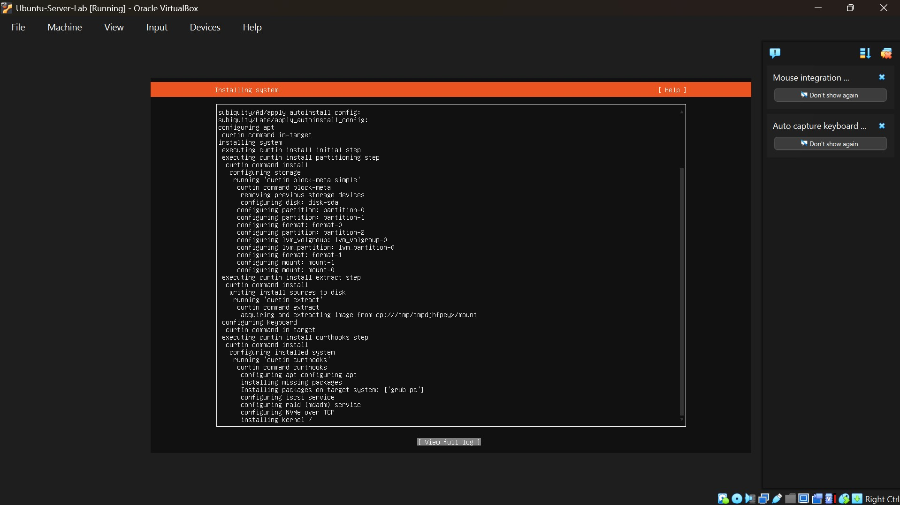
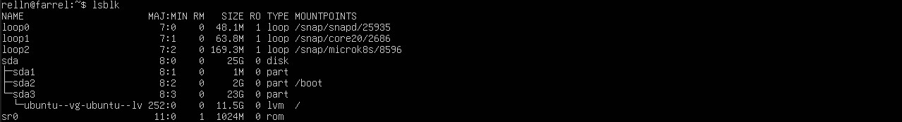
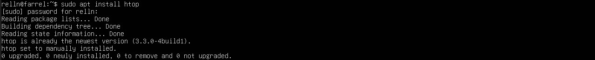

# 1 JOBSHEET-1

## 1.10.1. Latihan Konseptual
### Latihan 1.1
Jelaskan 5 fungsi utama sistem operasi dengan contoh konkret dari minimal 2
OS berbeda (Windows, macOS, atau Linux).
= Manajemen Proses, Manajemen Memori Utama, Manajemen File, Manajemen Perangkat Input/Output, Manajemen Keamanan

### Latihan 1.2
Kapan sebaiknya menggunakan Windows vs Linux vs macOS? Analisis
berdasarkan use case: gaming, development, server, creative work, dan enterprise.
= Gaming (Unggul: Windows), Development / Programming (Unggul: macOS & Linux), Server (Unggul: Linux), 
Creative Work (Unggul: macOS & Windows), Enterprise (Unggul : Windows)

## 1.10.2. Latihan Praktikal
### Latihan 1.3
Install Ubuntu Server 22.04 LTS di VirtualBox dengan langkah berikut:
1. Download Ubuntu Server ISO dari website resmi
2. Create VM baru di VirtualBox (RAM: 2GB, Disk: 25GB)
3. Install dengan automatic partitioning (guided)
4. Buat user account dengan password yang kuat
5. Reboot dan login ke sistem
6. Dokumentasikan proses instalasi dengan screenshot key steps

### Latihan 1.4
Setelah instalasi Ubuntu Server, lakukan tasks berikut:
1. Update package list: sudo apt update

2. Upgrade packages: sudo apt upgrade

3. Install neofetch: sudo apt install neofetch

4. Jalankan neofetch dan screenshot hasilnya

5. Check disk usage dengan df -h

6. Check memory dengan free -h

7. Dokumentasikan output dari setiap command

### Latihan 1.5
Eksplorasi sistem yang baru diinstall:
1. Tampilkan informasi OS: cat /etc/os-release

2. Tampilkan versi kernel: uname -r

3. List partisi: lsblk

4. Check network connectivity: ping -c 4 google.com

5. Install dan jalankan htop untuk melihat resource usage

.jpg)
6. Buat laporan singkat tentang konfigurasi sistem Anda
= Laporan Konfigurasi Sistem
1. Identitas Pengguna
Nama Lengkap: Farrel Novrizha Hidayat
Nama Panggilan: farrel
2. Spesifikasi Lingkungan Virtual
Berdasarkan dokumentasi praktikum terbaru, sistem berjalan di atas lingkungan virtual dengan detail sebagai berikut:
Platform Virtualisasi: Oracle VM VirtualBox
Sistem Operasi Tamu (Guest OS): Ubuntu Server (LTS)
Hostname: farrel (tertera pada prompt relln@farrel di terminal)
Alokasi Memori (RAM): Total sebesar 1.92 GB
Alokasi Swap: 2.00 GB
3. Status Operasional Sistem (Monitoring via htop)
Hasil pemantauan real-time menunjukkan distribusi beban kerja sebagai berikut:
Penggunaan CPU: Berada di kisaran 20.3%, terutama digunakan untuk menjalankan proses latar belakang.
Penggunaan RAM: Terpakai sebesar 860 MB (sekitar 44% dari total alokasi).
Layanan Utama yang Berjalan: MicroK8s (Kubernetes), termasuk kube-scheduler dan containerd yang dikelola oleh user root.
Waktu Aktif (Uptime): Sistem telah berjalan stabil selama 01:34:59.
4. Konfigurasi Keamanan & Akses
User Management: Menggunakan user spesifik relln dengan hak akses administratif melalui perintah sudo.
Keamanan Data: Mengintegrasikan sistem hak akses berbasis Linux untuk melindungi integritas file sistem dan konfigurasi jaringan.

## 1.10.3. Latihan Refleksi
### Latihan 1.6
Ceritakan pengalaman Anda dengan sistem operasi:
1. Sistem operasi apa yang Anda gunakan sehari-hari? (Windows, macOS,
Linux, atau lainnya)
= Windowns
2. Berapa lama Anda menggunakan sistem operasi tersebut?
= 10 tahun
3. Apa yang Anda sukai dari sistem operasi tersebut?
= sistemnya sederhana, mudah digunakan dan banyak laptop/pc terutama jenis lama juga menggunakan windows
4. Apa tantangan atau masalah yang pernah Anda hadapi?
= windows error atau penyimpanan yang berlebih ketika menyentuh windows 11
5. Apakah Anda pernah menggunakan sistem operasi lain? Bandingkan
pengalaman Anda.
= blom pernah
6. Setelah mempelajari bab ini, apakah ada sistem operasi lain yang ingin
Anda coba? Mengapa?
Tulis refleksi Anda dalam 300-500 kata disertai dengan dokumentasi.
= Setelah mendalami bab ini, saya menyadari bahwa OS bukan sekadar antarmuka grafis, melainkan arsitek utama yang mengelola interaksi antara hardware dan software. Berdasarkan praktikum yang saya lakukan menggunakan Ubuntu Server, saya tertarik untuk mengeksplorasi Arch Linux sebagai langkah pembelajaran berikutnya. Alasan saya memilih Arch Linux karena sistem ini sangat relevan dengan apa yang akan saya pelajari yaitu pemrogaman java, struktur jaringan dan manajemen sistem. untuk dokumentasinya dibawah ini, saya telah mengonfigurasi Ubuntu Server dengan contoh melalui tool htop, terpantau pengunaan RAM Sebesar 893 mb dari 1,92 gb.
.jpg)
Refleksi ini memperkuat pemahaman saya bahwa pemilihan OS harus didasarkan pada kebutuhan use case. Bagi saya sebagai mahasiswa, mencoba sistem yang lebih kompleks seperti Arch Linux adalah investasi keterampilan teknis yang krusial untuk manajemen infrastruktur IT di masa depan.

